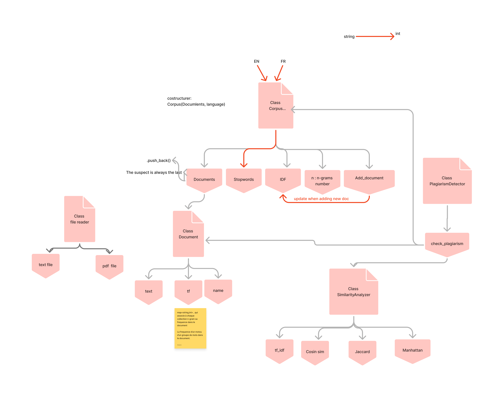
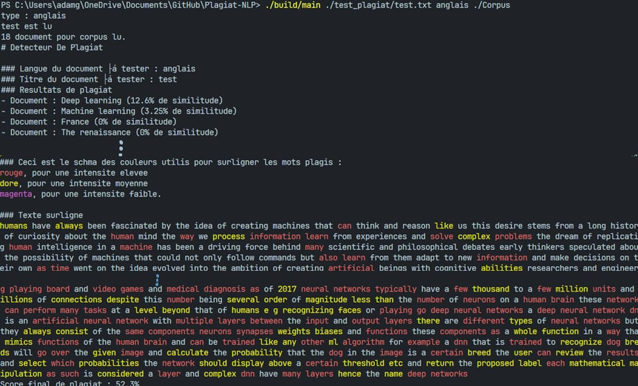
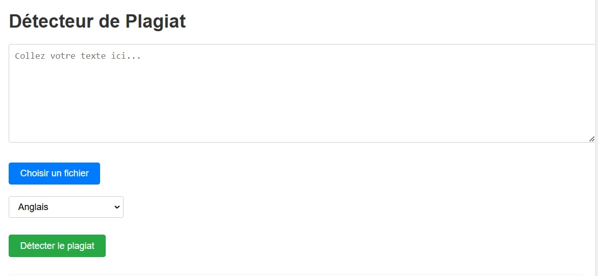
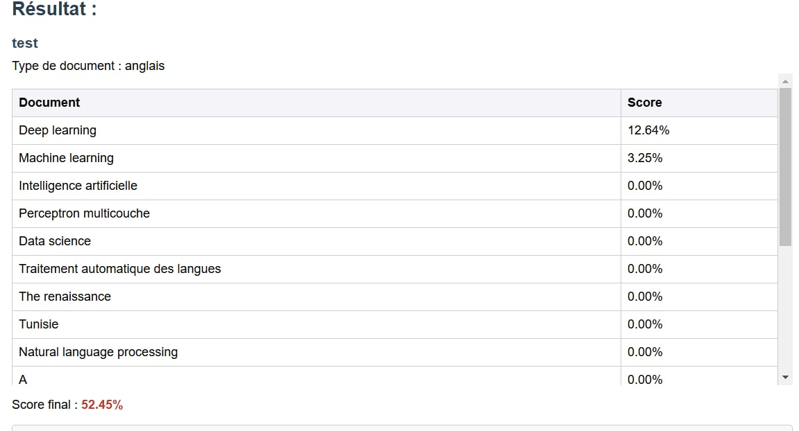
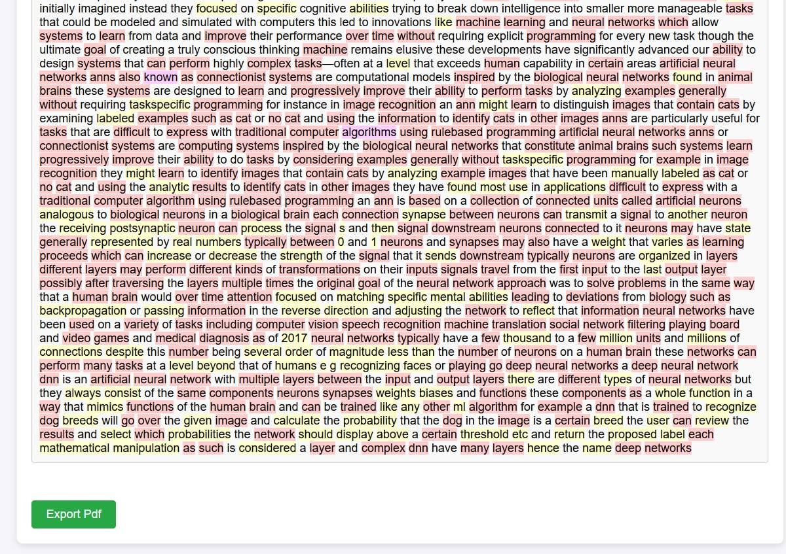

```markdown
# Détecteur de Plagiat

Ce projet est un outil de détection de plagiat qui permet de comparer un document donné avec un corpus de référence pour identifier les similitudes et les éventuels cas de plagiat. Il supporte plusieurs langues (français, anglais) et formats de code (C++, Python).
Elabroré dans le cadre du cours de C++ de la 2ème année en ENSTA.
## Table des Noms

| Nom            | Rôle                  |
|----------------|-----------------------|
| Aziz BEN AMIRA | Développeur Principal |
| Adam GASSEM    | Développeur Principal |

## Fonctionnalités

- **Analyse de similarité** : Compare un document avec un corpus de référence en utilisant des n-grammes pour détecter les similitudes.
- **Surlignage des parties plagiées** : Met en évidence les parties du texte qui sont similaires à celles du corpus.
- **Support multi-langues** : Supporte l'analyse de documents en français, anglais, C++, et Python.
- **Interface HTTP** : Expose une API REST pour l'analyse de plagiat via un serveur HTTP.

## Structure du Projet

Le projet est organisé comme suit :

- **`main.cpp`** : Point d'entrée principal pour l'analyse de plagiat en ligne de commande.
- **`server.cpp`** : Serveur HTTP qui expose une API REST pour l'analyse de plagiat.
- **`document.hpp`** : Définit la classe `Document` qui représente un document texte.
- **`corpus.hpp`** : Définit la classe `Corpus` qui représente une collection de documents.
- **`file_reader.hpp`** : Contient la classe `FileReader` pour lire des fichiers et des dossiers.
- **`similarity_analyzer.hpp`** : Contient la classe `SimilarityAnalyzer` pour analyser la similarité entre les documents.
- **`plagiarism_detector.hpp`** : Contient la classe `PlagiarismDetector` pour détecter le plagiat.

## Architecture 



## Resultat

### Exemple de Sortie en Ligne de Commande



### Application web






## Utilisation

### En ligne de commande

Pour utiliser le détecteur de plagiat en ligne de commande, exécutez la commande suivante :

```bash
./build/main <test_file> <type> <corpus_path> (<output_path>/terminal par défaut)
```

- **`<test_file>`** : Chemin vers le fichier à analyser.
- **`<type>`** : Type de document (`anglais`, `fr`, `c++`, `py`).
- **`<corpus_path>`** : Chemin vers le dossier contenant le corpus de référence.
- **`<output_path>`** : (Optionnel) Chemin vers le fichier de sortie. Si non spécifié, les résultats sont affichés dans le terminal.

### Via l'API HTTP

Pour utiliser le serveur HTTP, exécutez la commande suivante :

```bash
./server
```

Le serveur écoutera sur `http://localhost:8080/`. Vous pouvez envoyer une requête POST à l'endpoint `/detect_plagiarism` avec un JSON contenant le texte à analyser et son type.

Exemple de requête JSON :

```json
{
    "text": "Votre texte ici",
    "type": "fr"
}
```

La réponse contiendra les scores de similarité, le score final de plagiat, et le texte surligné.
```json
{
    "scores": ["document1": 85.5, "document2": 72.3, "document3": 65.8 ...],
    "final_score": "final_score",
    "highlighted_text": "highlighted_text"
}
```
## Dépendances

- **`httplib.h`** : Bibliothèque pour créer un serveur HTTP.
- **`nlohmann/json.hpp`** : Bibliothèque pour manipuler des données JSON.

## Compilation

Pour compiler le projet, utilisez la commande suivante :

```bash
g++ -std=c++17 -o main main.cpp ./src/document.cpp ./src/corpus.cpp -I./include
g++ -std=c++17 server.cpp ./src/document.cpp ./src/corpus.cpp -o server.exe -I./include -lws2_32 -lwsock32
```

## Exemple de Sortie

### En ligne de commande

```bash
# Détecteur De Plagiat
### Langue du document à tester : fr
### Titre du document à tester : document_test

### Résultats de plagiat
- Document : document1 (85.5% de similitude)
- Document : document2 (72.3% de similitude)
- Document : document3 (65.8% de similitude)

### Ceci est le schéma des couleurs utilisé pour surligner les mots plagiés :
\033[31mrouge\033[0m, pour une intensite elevee
\033[33mdore\033[0m, pour une intensite moyenne
\033[35mmagenta\033[0m, pour une intensite faible.

### Texte surligné
Ceci est un \033[31mtexte\033[0m avec des \033[33mmots\033[0m plagiés.

Score final de plagiat : 85.5%
```

### Via l'API HTTP

Réponse JSON :

```json
{
    "scores": [
        {"document1": 85.5},
        {"document2": 72.3},
        {"document3": 65.8}
    ],
    "final_score": 85.5,
    "highlighted_text": "Ceci est un <red>texte</red> avec des <yellow>mots</yellow> plagiés."
}
```

## Auteurs

-  [BEN AMIRA AZIZ] & [GASSEM ADAM]

## Licence

### Licence des Bibliothèques

Ce projet utilise les bibliothèques suivantes, chacune sous une licence spécifique :

#### nlohmann/json.hpp

La bibliothèque `nlohmann/json.hpp` est sous licence MIT. Voici un extrait de la licence :

```
MIT License

Copyright (c) 2013-2023 Niels Lohmann

Permission is hereby granted, free of charge, to any person obtaining a copy
of this software and associated documentation files (the "Software"), to deal
in the Software without restriction, including without limitation the rights
to use, copy, modify, merge, publish, distribute, sublicense, and/or sell
copies of the Software, and to permit persons to whom the Software is
furnished to do so, subject to the following conditions:

The above copyright notice and this permission notice shall be included in all
copies or substantial portions of the Software.

THE SOFTWARE IS PROVIDED "AS IS", WITHOUT WARRANTY OF ANY KIND, EXPRESS OR
IMPLIED, INCLUDING BUT NOT LIMITED TO THE WARRANTIES OF MERCHANTABILITY,
FITNESS FOR A PARTICULAR PURPOSE AND NONINFRINGEMENT. IN NO EVENT SHALL THE
AUTHORS OR COPYRIGHT HOLDERS BE LIABLE FOR ANY CLAIM, DAMAGES OR OTHER
LIABILITY, WHETHER IN AN ACTION OF CONTRACT, TORT OR OTHERWISE, ARISING FROM,
OUT OF OR IN CONNECTION WITH THE SOFTWARE OR THE USE OR OTHER DEALINGS IN THE
SOFTWARE.
```

#### httplib.h

La bibliothèque `httplib.h` est sous licence MIT. Voici un extrait de la licence :

```
MIT License

Copyright (c) 2023 Yuji Hirose

Permission is hereby granted, free of charge, to any person obtaining a copy
of this software and associated documentation files (the "Software"), to deal
in the Software without restriction, including without limitation the rights
to use, copy, modify, merge, publish, distribute, sublicense, and/or sell
copies of the Software, and to permit persons to whom the Software is
furnished to do so, subject to the following conditions:

The above copyright notice and this permission notice shall be included in all
copies or substantial portions of the Software.

THE SOFTWARE IS PROVIDED "AS IS", WITHOUT WARRANTY OF ANY KIND, EXPRESS OR
IMPLIED, INCLUDING BUT NOT LIMITED TO THE WARRANTIES OF MERCHANTABILITY,
FITNESS FOR A PARTICULAR PURPOSE AND NONINFRINGEMENT. IN NO EVENT SHALL THE
AUTHORS OR COPYRIGHT HOLDERS BE LIABLE FOR ANY CLAIM, DAMAGES OR OTHER
LIABILITY, WHETHER IN AN ACTION OF CONTRACT, TORT OR OTHERWISE, ARISING FROM,
OUT OF OR IN CONNECTION WITH THE SOFTWARE OR THE USE OR OTHER DEALINGS IN THE
SOFTWARE.
```


